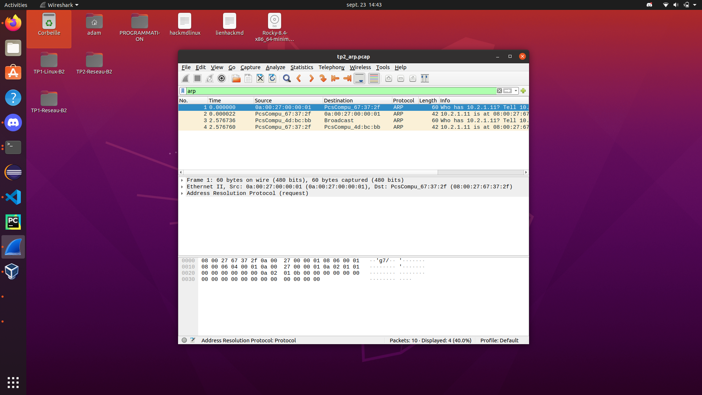

# TP2-Reseau-B2
### Echange ARP
#### Générer des requêtes ARP
##### effectuer un ping d'une machine à l'autre
*node1.net.tp2*
```
ping 10.2.1.12
PING 10.2.1.12 (10.2.1.12) 56(84) bytes of data.
64 bytes from 10.2.1.12: icmp_seq=1 ttl=64 time=1.32 ms
64 bytes from 10.2.1.12: icmp_seq=2 ttl=64 time=0.971 ms
64 bytes from 10.2.1.12: icmp_seq=3 ttl=64 time=1.07 ms
^C
--- 10.2.1.12 ping statistics ---
3 packets transmitted, 3 received, 0% packet loss, time 2003ms
rtt min/avg/max/mdev = 0.971/1.122/1.322/0.147 ms

```
*node2.net.tp2*
```
ping 10.2.1.11
PING 10.2.1.11 (10.2.1.11) 56(84) bytes of data.
64 bytes from 10.2.1.11: icmp_seq=1 ttl=64 time=0.304 ms
64 bytes from 10.2.1.11: icmp_seq=2 ttl=64 time=1.03 ms
64 bytes from 10.2.1.11: icmp_seq=3 ttl=64 time=0.991 ms
^C
--- 10.2.1.11 ping statistics ---
3 packets transmitted, 3 received, 0% packet loss, time 2039ms
rtt min/avg/max/mdev = 0.304/0.775/1.031/0.334 ms
```
##### observer les tables ARP des deux machines
*node1.net.tp2*
```
 ip n s
10.2.1.1 dev enp0s8 lladdr 0a:00:27:00:00:01 REACHABLE
10.2.1.12 dev enp0s8 lladdr 08:00:27:4d:bc:bb STALE
```
*node2.net.tp2*
```
ip n s
10.2.1.1 dev enp0s8 lladdr 0a:00:27:00:00:01 REACHABLE
10.2.1.11 dev enp0s8 lladdr 08:00:27:67:37:2f STALE
```
##### repérer l'adresse MAC de node1 dans la table ARP de node2 et vice-versa
*node1.net.tp2*
```
L'adresse MAC de node2 est 08:00:27:4d:bc:bb
```
*node2.net.tp2*
```
L'adresse MAC de node1 est 08:00:27:67:37:2f
```
##### prouvez que l'info est correcte (que l'adresse MAC que vous voyez dans la table est bien celle de la machine correspondante)
###### une commande pour voir la table ARP de node1
```
ip n s
10.2.1.12 dev enp0s8 lladdr 08:00:27:4d:bc:bb STALE
10.2.1.1 dev enp0s8 lladdr 0a:00:27:00:00:01 DELAY
```
###### et une commande pour voir la MAC de node2
```
ip a
1: lo: <LOOPBACK,UP,LOWER_UP> mtu 65536 qdisc noqueue state UNKNOWN group default qlen 1000
    link/loopback 00:00:00:00:00:00 brd 00:00:00:00:00:00
    inet 127.0.0.1/8 scope host lo
       valid_lft forever preferred_lft forever
    inet6 ::1/128 scope host 
       valid_lft forever preferred_lft forever
2: enp0s3: <BROADCAST,MULTICAST,UP,LOWER_UP> mtu 1500 qdisc fq_codel state UP group default qlen 1000
    link/ether 08:00:27:91:74:87 brd ff:ff:ff:ff:ff:ff
3: enp0s8: <BROADCAST,MULTICAST,UP,LOWER_UP> mtu 1500 qdisc fq_codel state UP group default qlen 1000
    link/ether 08:00:27:4d:bc:bb brd ff:ff:ff:ff:ff:ff
    inet 10.2.1.12/24 brd 10.2.1.255 scope global noprefixroute enp0s8
       valid_lft forever preferred_lft forever
    inet6 fe80::a00:27ff:fe4d:bcbb/64 scope link 
       valid_lft forever preferred_lft forever
```
#### 2.Analyse de trames
##### utilisez la commande tcpdump pour réaliser une capture de trame
```
sudo tcpdump -i enp0s8 -c 10 -w tp2_arp.pcap not port 22
dropped privs to tcpdump
tcpdump: listening on enp0s8, link-type EN10MB (Ethernet), capture size 262144 bytes
10 packets captured
10 packets received by filter
0 packets dropped by kernel
```
##### videz vos tables ARP, sur les deux machines, puis effectuez un ping
```
sudo ip neigh flush all
[sudo] password for adam: 
[adam@node1 ~]$ ip n s
10.2.1.1 dev enp0s8 lladdr 0a:00:27:00:00:01 REACHABLE
```
```
ping 10.2.1.11
PING 10.2.1.11 (10.2.1.11) 56(84) bytes of data.
64 bytes from 10.2.1.11: icmp_seq=1 ttl=64 time=0.561 ms
64 bytes from 10.2.1.11: icmp_seq=2 ttl=64 time=1.11 ms
64 bytes from 10.2.1.11: icmp_seq=3 ttl=64 time=1.00 ms
64 bytes from 10.2.1.11: icmp_seq=4 ttl=64 time=0.918 ms
^C
--- 10.2.1.11 ping statistics ---
4 packets transmitted, 4 received, 0% packet loss, time 3009ms
rtt min/avg/max/mdev = 0.561/0.897/1.110/0.206 ms

```
##### stoppez la capture, et exportez-la sur votre hôte pour visualiser avec Wireshark
##### mettez en évidence les trames ARP

**écrivez, dans l'ordre, les échanges ARP qui ont eu lieu, je veux TOUTES les trames**
- uniquement l'ARP
- sans doublons de trame, dans le cas où vous avez des trames en double

| ordre | type trame  | source                         | destination                   |
|-------|-------------|--------------------------------|-------------------------------|
| 1     | Requête ARP | `vboxnet1` `0a:00:27:00:00:01` | `node1`    `08:00:27:67:37:2f`|
| 2     | Réponse ARP | `node1`    `08:00:27:67:37:2f` | `vboxnet1` `0a:00:27:00:00:01`|
| 3     | Requête ARP | `node2`    `08:00:27:4d:bc:bb` | `BROADCAST``ff:ff:ff:ff:ff:ff`|
| 4     | Réponse ARP | `node1`    `08:00:27:67:37:2f` | `node2`    `08:00:27:4d:bc:bb`|

## II. Routage
 #### 1. Mise en place du routage
 ##### Activer le routage sur le noeud router.net2.tp2
 ```
sudo firewall-cmd --list-all
[sudo] password for adam: 
public (active)
  target: default
  icmp-block-inversion: no
  interfaces: enp0s3 enp0s8 enp0s9
  sources: 
  services: cockpit dhcpv6-client ssh
  ports: 
  protocols: 
  masquerade: no
  forward-ports: 
  source-ports: 
  icmp-blocks: 
  rich rules: 
  ```
  ```
[adam@router ~]$ sudo firewall-cmd --get-active-zone
public
  interfaces: enp0s3 enp0s8 enp0s9
 ```
 ```
[adam@router ~]$ sudo firewall-cmd --add-masquerade --zone=public
success
```
```
[adam@router ~]$ sudo firewall-cmd --add-masquerade --zone=public --permanent
success
 ```
 ##### Ajouter les routes statiques nécessaires pour que node1.net1.tp2 et marcel.net2.tp2 puissent se ping
 ###### il faut ajouter une seule route des deux côtés
 ```
sudo ip route add 10.2.1.11 via 10.2.1.254 dev enp0s8
[sudo] password for adam: 
ip r s
default via 10.0.2.2 dev enp0s3 proto dhcp metric 100 
10.0.2.0/24 dev enp0s3 proto kernel scope link src 10.0.2.15 metric 100 
10.2.1.0/24 dev enp0s8 proto kernel scope link src 10.2.1.254 metric 101 
10.2.1.11 via 10.2.1.254 dev enp0s8 
10.2.2.0/24 dev enp0s9 proto kernel scope link src 10.2.2.254 metric 102 
 ```
 ```
 sudo ip route add 10.2.2.12 via 10.2.2.254 dev enp0s9
[adam@router ~]$ ip r s
default via 10.0.2.2 dev enp0s3 proto dhcp metric 100 
10.0.2.0/24 dev enp0s3 proto kernel scope link src 10.0.2.15 metric 100 
10.2.1.0/24 dev enp0s8 proto kernel scope link src 10.2.1.254 metric 101 
10.2.1.11 via 10.2.1.254 dev enp0s8 
10.2.2.0/24 dev enp0s9 proto kernel scope link src 10.2.2.254 metric 102 
10.2.2.12 via 10.2.2.254 dev enp0s9 
 ```
 ###### une fois les routes en place, vérifiez avec un ping que les deux machines peuvent se joindre
 *node1.net1.tp2 ping marcel*
 ```
[adam@node1 ~]$ ping 10.2.2.12
PING 10.2.2.12 (10.2.2.12) 56(84) bytes of data.
64 bytes from 10.2.2.12: icmp_seq=1 ttl=63 time=0.782 ms
64 bytes from 10.2.2.12: icmp_seq=2 ttl=63 time=2.08 ms
^C
--- 10.2.2.12 ping statistics ---
2 packets transmitted, 2 received, 0% packet loss, time 1064ms
rtt min/avg/max/mdev = 0.782/1.430/2.078/0.648 ms
 ```
*marcel ping node1*
 ```
 [adam@marcel ~]$ ping 10.2.1.11
PING 10.2.1.11 (10.2.1.11) 56(84) bytes of data.
64 bytes from 10.2.1.11: icmp_seq=1 ttl=63 time=0.654 ms
64 bytes from 10.2.1.11: icmp_seq=2 ttl=63 time=1.84 ms
64 bytes from 10.2.1.11: icmp_seq=3 ttl=63 time=0.650 ms
^C
--- 10.2.1.11 ping statistics ---
3 packets transmitted, 3 received, 0% packet loss, time 2049ms
rtt min/avg/max/mdev = 0.650/1.047/1.837/0.558 ms
```
### 2.Analyse de trames
##### Analyse des échanges ARP
###### videz les tables ARP des trois noeuds
```
[adam@router ~]$ sudo ip neigh flush all
[sudo] password for adam: 
```
```
[adam@node1 ~]$ sudo ip neigh flush all
[sudo] password for adam: 
```
```
[adam@marcel ~]$ sudo ip neigh flush all
[sudo] password for adam: 
```
###### effectuez un ping de node1.net1.tp2 vers marcel.net2.tp2
```
[adam@node1 ~]$ ping 10.2.2.12
PING 10.2.2.12 (10.2.2.12) 56(84) bytes of data.
64 bytes from 10.2.2.12: icmp_seq=1 ttl=63 time=2.24 ms
64 bytes from 10.2.2.12: icmp_seq=2 ttl=63 time=1.99 ms
64 bytes from 10.2.2.12: icmp_seq=3 ttl=63 time=1.90 ms
^C
--- 10.2.2.12 ping statistics ---
3 packets transmitted, 3 received, 0% packet loss, time 2003ms
rtt min/avg/max/mdev = 1.899/2.041/2.236/0.147 ms
```
###### regardez les tables ARP des trois noeuds
```
[adam@router ~]$ ip n s
10.2.1.11 dev enp0s8 lladdr 08:00:27:67:37:2f REACHABLE
10.0.2.2 dev enp0s3 lladdr 52:54:00:12:35:02 REACHABLE
10.2.2.12 dev enp0s9 lladdr 08:00:27:77:3f:43 DELAY
10.2.1.1 dev enp0s8 lladdr 0a:00:27:00:00:01 DELAY
```
```
[adam@node1 ~]$ ip n s
10.2.1.1 dev enp0s8 lladdr 0a:00:27:00:00:01 DELAY
10.2.1.254 dev enp0s8 lladdr 08:00:27:4d:bc:bb REACHABLE
```
```
[adam@marcel ~]$ ip n s
10.2.2.254 dev enp0s8 lladdr 08:00:27:b1:c5:1c REACHABLE
10.2.2.1 dev enp0s8 lladdr 0a:00:27:00:00:02 DELAY
```
###### essayez de déduire un peu les échanges ARP qui ont eu lieu
```
On peux déduire qu'il y à eu des échanges de requêtes notament un requêste et un reply
qui permettte de determiner qui à l'adresse IP x.x.x.x pour l'adresse MAC XX:XX:XX:XX:XX:XX 
donc node1 demande au routeur qui à l'adresse IP pour un MAC precise et le routeur vas demander
la même chose à marcel.
```
###### répétez l'opération précédente (vider les tables, puis ping), en lançant tcpdump sur les 3 noeuds, afin de capturer les échanges depuis les 3 points de vue
```
[adam@router ~]$ sudo ip neigh flush all
[sudo] password for adam: 
```
```
[adam@node1 ~]$ sudo ip neigh flush all
[adam@node1 ~]$ 
```
```
[adam@marcel ~]$ sudo ip neigh flush all
[sudo] password for adam: 
```
```
[adam@node1 ~]$ sudo tcpdump -i enp0s8 -c 100 -w tp2_routage_node1.pcap not port 22
dropped privs to tcpdump
tcpdump: listening on enp0s8, link-type EN10MB (Ethernet), capture size 262144 bytes
100 packets captured
100 packets received by filter
0 packets dropped by kernel
```
```
[adam@marcel ~]$ sudo tcpdump -i enp0s8 -c 100 -w tp2_routage_marcel.pcap not port 22
dropped privs to tcpdump
tcpdump: listening on enp0s8, link-type EN10MB (Ethernet), capture size 262144 bytes
100 packets captured
100 packets received by filter
0 packets dropped by kernel
```
```
[adam@node1 ~]$ ping 10.2.2.12
PING 10.2.2.12 (10.2.2.12) 56(84) bytes of data.
64 bytes from 10.2.2.12: icmp_seq=1 ttl=63 time=1.61 ms
64 bytes from 10.2.2.12: icmp_seq=2 ttl=63 time=2.13 ms
64 bytes from 10.2.2.12: icmp_seq=3 ttl=63 time=1.97 ms
```
**écrivez, dans l'ordre, les échanges ARP qui ont eu lieu, puis le ping et le pong, je veux TOUTES les trames utiles pour l'échange**

| ordre | type trame  | IP source           | MAC source                   | IP destination      | MAC destination            |
|-------|-------------|---------------------|------------------------------|---------------------|----------------------------|
| 1     | Requête ARP | x                   | `node1` `PcsCompu_67:37:2f`  | x                   |Broadcast `ff:ff:ff:ff:ff`  |
| 2     | Réponse ARP | x                   | `router` `PcsCompu_4d:bc:bb` | x                   |`node1` `PcsCompu_67:37:2f` |
| 3     | ping `ICMP` | `node1` `10.2.1.11` | `node1` `PcsCompu_67:37:2f`  |`marcel` `10.2.2.12` |`router` `PcsCompu_4d:bc:bb`|
| 4     | Pong `ICMP` | `marcel` `10.2.2.12`| `router` `PcsCompu_4d:bc:bb` |`node1` `10.2.1.11`  |`node1`  `PcsCompu_67:37:2f`|

### 3. Accès internet

*Donnez un accès internet à vos machines**

- le routeur a déjà un accès internet
```
[adam@router ~]$ ping google.com
PING google.com (142.250.178.142) 56(84) bytes of data.
64 bytes from par21s22-in-f14.1e100.net (142.250.178.142): icmp_seq=1 ttl=63 time=12.9 ms
64 bytes from par21s22-in-f14.1e100.net (142.250.178.142): icmp_seq=2 ttl=63 time=16.2 ms
^C
--- google.com ping statistics ---
2 packets transmitted, 2 received, 0% packet loss, time 1002ms
rtt min/avg/max/mdev = 12.858/14.543/16.229/1.689 ms
```
- ajoutez une route par défaut à `node1.net1.tp2` et `marcel.net2.tp2`

`node1.net1.tp2`
```
[adam@node1 ~]$ sudo cat /etc/sysconfig/network-scripts/ifcfg-enp0s8

NAME=enp0s8
DEVICE=enp0s8
BOOTPROTO=STATIC
ONBOOT=yes
IPADDR=10.2.1.11
NETMASK=255.255.255.0
GATEWAY=10.2.1.254
```
```
[adam@node1 ~]$ ip r s
default via 10.2.1.254 dev enp0s8 proto static metric 101 
10.2.1.0/24 dev enp0s8 proto kernel scope link src 10.2.1.11 metric 101 
```

`marcel.net2.tp2`
```
[adam@marcel ~]$ sudo cat /etc/sysconfig/network-scripts/ifcfg-enp0s8

NAME=enp0s8
DEVICE=enp0s8
BOOTPROTO=STATIC
ONBOOT=yes
IPADDR=10.2.2.12
NETMASK=255.255.255.0
GATEWAY=10.2.2.254
```
```
[adam@marcel ~]$ ip r s
default via 10.2.2.254 dev enp0s8 proto static metric 101 
10.2.2.0/24 dev enp0s8 proto kernel scope link src 10.2.2.12 metric 101 
```
  - vérifiez que vous avez accès internet avec un `ping`
  - le `ping` doit être vers une IP, PAS un nom de domaine

`node1.net1.tp2`
```
[adam@node1 ~]$ ping 8.8.8.8
PING 8.8.8.8 (8.8.8.8) 56(84) bytes of data.
64 bytes from 8.8.8.8: icmp_seq=1 ttl=61 time=13.9 ms
64 bytes from 8.8.8.8: icmp_seq=2 ttl=61 time=18.6 ms
64 bytes from 8.8.8.8: icmp_seq=3 ttl=61 time=15.9 ms
^C
--- 8.8.8.8 ping statistics ---
3 packets transmitted, 3 received, 0% packet loss, time 2004ms
rtt min/avg/max/mdev = 13.909/16.132/18.564/1.906 ms
```

`marcel.net2.tp2`
```
[adam@marcel ~]$ ping 8.8.8.8
PING 8.8.8.8 (8.8.8.8) 56(84) bytes of data.
64 bytes from 8.8.8.8: icmp_seq=1 ttl=61 time=15.9 ms
64 bytes from 8.8.8.8: icmp_seq=2 ttl=61 time=14.6 ms
64 bytes from 8.8.8.8: icmp_seq=3 ttl=61 time=16.4 ms
^C
--- 8.8.8.8 ping statistics ---
3 packets transmitted, 3 received, 0% packet loss, time 2004ms
rtt min/avg/max/mdev = 14.553/15.612/16.369/0.771 ms
```
- donnez leur aussi l'adresse d'un serveur DNS qu'ils peuvent utiliser

`node1.net1.tp2`
```
[adam@node1 ~]$ sudo cat /etc/sysconfig/network-scripts/ifcfg-enp0s8
[sudo] password for adam: 

NAME=enp0s8
DEVICE=enp0s8
BOOTPROTO=STATIC
ONBOOT=yes
IPADDR=10.2.1.11
NETMASK=255.255.255.0
GATEWAY=10.2.1.254
DNS1=8.8.8.8
```

`marcel.net2.tp2`
```
[adam@marcel ~]$ sudo cat /etc/sysconfig/network-scripts/ifcfg-enp0s8
[sudo] password for adam: 

NAME=enp0s8
DEVICE=enp0s8
BOOTPROTO=STATIC
ONBOOT=yes
IPADDR=10.2.2.12
NETMASK=255.255.255.0
GATEWAY=10.2.2.254
DNS1=8.8.8.8
```
  - vérifiez que vous avez une résolution de noms qui fonctionne avec `dig`

 `node1.net1.tp2`
 ```
[adam@node1 ~]$ dig google.com

; <<>> DiG 9.11.26-RedHat-9.11.26-4.el8_4 <<>> google.com
;; global options: +cmd
;; Got answer:
;; ->>HEADER<<- opcode: QUERY, status: NOERROR, id: 48281
;; flags: qr rd ra; QUERY: 1, ANSWER: 1, AUTHORITY: 0, ADDITIONAL: 1

;; OPT PSEUDOSECTION:
; EDNS: version: 0, flags:; udp: 512
;; QUESTION SECTION:
;google.com.			IN	A

;; ANSWER SECTION:
google.com.		300	IN	A	216.58.206.238

;; Query time: 23 msec
;; SERVER: 8.8.8.8#53(8.8.8.8)
;; WHEN: Sun Sep 26 16:05:52 CEST 2021
;; MSG SIZE  rcvd: 55
```
`marcel.net2.tp2`
```
[adam@marcel ~]$ dig google.com

; <<>> DiG 9.11.26-RedHat-9.11.26-4.el8_4 <<>> google.com
;; global options: +cmd
;; Got answer:
;; ->>HEADER<<- opcode: QUERY, status: NOERROR, id: 47618
;; flags: qr rd ra; QUERY: 1, ANSWER: 1, AUTHORITY: 0, ADDITIONAL: 1

;; OPT PSEUDOSECTION:
; EDNS: version: 0, flags:; udp: 512
;; QUESTION SECTION:
;google.com.			IN	A

;; ANSWER SECTION:
google.com.		103	IN	A	142.250.178.142

;; Query time: 21 msec
;; SERVER: 8.8.8.8#53(8.8.8.8)
;; WHEN: Sun Sep 26 16:07:59 CEST 2021
;; MSG SIZE  rcvd: 55
```
  - puis avec un `ping` vers un nom de domaine 

`node1.net1.tp2`
```
[adam@node1 ~]$ ping google.com
PING google.com (142.250.179.110) 56(84) bytes of data.
64 bytes from par21s20-in-f14.1e100.net (142.250.179.110): icmp_seq=1 ttl=61 time=12.10 ms
64 bytes from par21s20-in-f14.1e100.net (142.250.179.110): icmp_seq=2 ttl=61 time=16.3 ms
64 bytes from par21s20-in-f14.1e100.net (142.250.179.110): icmp_seq=3 ttl=61 time=15.6 ms
^C
--- google.com ping statistics ---
3 packets transmitted, 3 received, 0% packet loss, time 2004ms
rtt min/avg/max/mdev = 12.958/14.960/16.311/1.447 ms
```
`marcel.net2.tp2`
```
[adam@marcel ~]$ ping google.com
PING google.com (216.58.206.238) 56(84) bytes of data.
64 bytes from par10s34-in-f14.1e100.net (216.58.206.238): icmp_seq=1 ttl=61 time=11.8 ms
64 bytes from par10s34-in-f14.1e100.net (216.58.206.238): icmp_seq=2 ttl=61 time=14.9 ms
^C
--- google.com ping statistics ---
2 packets transmitted, 2 received, 0% packet loss, time 1002ms
rtt min/avg/max/mdev = 11.753/13.307/14.862/1.558 ms
```
Analyse de trames

- effectuez un `ping 8.8.8.8` depuis `node1.net1.tp2`
```
[adam@node1 ~]$ ping 8.8.8.8
PING 8.8.8.8 (8.8.8.8) 56(84) bytes of data.
64 bytes from 8.8.8.8: icmp_seq=1 ttl=61 time=14.5 ms
64 bytes from 8.8.8.8: icmp_seq=2 ttl=61 time=15.7 ms
[...]
```
- capturez le ping depuis `node1.net1.tp2` avec `tcpdump`
```
[adam@node1 ~]$ sudo tcpdump -i enp0s8 -c 100 -w tp2_routage_internet.pcap not port 22
[sudo] password for adam: 
dropped privs to tcpdump
tcpdump: listening on enp0s8, link-type EN10MB (Ethernet), capture size 262144 bytes
100 packets captured
100 packets received by filter
0 packets dropped by kernel
```
- analysez un ping aller et le retour qui correspond et mettez dans un tableau :

| ordre | type trame | IP source           | MAC source                  | IP destination     | MAC destination              |     |
|-------|------------|---------------------|-----------------------------|--------------------|------------------------------|-----|
| 1     | ping       | `node1` `10.2.1.11` | `node1` `PcsCompu_67:37:2f` | `DNS` `8.8.8.8`    | `router` `PcsCompu_4d:bc:bb` |     |
| 2     | pong       | `DNS` `8.8.8.8`     | `router` `PcsCompu_4d:bc:bb`| `node1` `10.2.1.11`| `node1` `PcsCompu_67:37:2f`  | ... |


## III. DHCP
### 1. Mise en place du serveur DHCP
**Sur la machine `node1.net1.tp2`, vous installerez et configurerez un serveur DHCP**
- installation du serveur sur `node1.net1.tp2`
```
[adam@node1 ~]$ sudo dnf install -y dhcp-server
[...]
Installed:
  dhcp-server-12:4.3.6-44.el8_4.1.x86_64                                        

Complete!
```
```
[adam@node1 ~]$ sudo cat /etc/dhcp/dhcpd.conf
#
# DHCP Server Configuration file.
#   see /usr/share/doc/dhcp-server/dhcpd.conf.example
#   see dhcpd.conf(5) man page
#
# default lease time
default-lease-time 600;

# max lease time
max-lease-time 7200;

# this DHCP server to be declared valid
authoritative;

# specify network address and subnetmask
subnet 10.2.1.0 netmask 255.255.255.0 {
    # specify the range of lease IP address
    range dynamic-bootp 10.2.1.13 10.2.1.40;
    # specify broadcast address
    option broadcast-address 10.2.1.255;
    # specify gateway
    option routers 10.2.1.254;
}
```
```
[adam@node1 ~]$ sudo systemctl enable --now dhcpd
Created symlink /etc/systemd/system/multi-user.target.wants/dhcpd.service → /usr/lib/systemd/system/dhcpd.service.
```
- créer une machine `node2.net1.tp2`


- faites lui récupérer une IP en DHCP à l'aide de votre serveur
```
sudo dhclient -v enp0s8
```


**Améliorer la configuration du DHCP**

- ajoutez de la configuration à votre DHCP pour qu'il donne aux clients, en plus de leur IP :
  - une route par défaut
  - un serveur DNS à utiliser
```
[adam@node1 ~]$ sudo cat /etc/dhcp/dhcpd.conf
#
# DHCP Server Configuration file.
#   see /usr/share/doc/dhcp-server/dhcpd.conf.example
#   see dhcpd.conf(5) man page
#
# default lease time
default-lease-time 600;

# max lease time
max-lease-time 7200;

# this DHCP server to be declared valid
authoritative;

# specify DNS server's hostname or IP address
option domain-name-servers     8.8.8.8; 

# specify network address and subnetmask
subnet 10.2.1.0 netmask 255.255.255.0 {
    # specify the range of lease IP address
    range dynamic-bootp 10.2.1.13 10.2.1.40;
    # specify broadcast address
    option broadcast-address 10.2.1.255;
    # specify gateway
    option routers 10.2.1.254;
}
```
- récupérez de nouveau une IP en DHCP sur `node2.net1.tp2` pour tester :
```
sudo dhclient -r -v enp0s8 
pour se liberer de l'IP
```


```
sudo dhclient -v enp0s8
pour demander une nouvelle IP
```
- `node2.net1.tp2` doit avoir une IP
- vérifier avec une commande qu'il a récupéré son IP


- vérifier qu'il peut `ping` sa passerelle
```
[adam@node2 ~]$ ping 10.2.1.254
PING 10.2.1.254 (10.2.1.254) 56(84) bytes of data.
64 bytes from 10.2.1.254: icmp_seq=1 ttl=64 time=0.997 ms
64 bytes from 10.2.1.254: icmp_seq=2 ttl=64 time=1.01 ms
^C
--- 10.2.1.254 ping statistics ---
2 packets transmitted, 2 received, 0% packet loss, time 1002ms
rtt min/avg/max/mdev = 0.997/1.001/1.006/0.031 ms
```
- il doit avoir une route par défaut
- vérifier la présence de la route avec une commande
```
[adam@node2 ~]$ ip r s
default via 10.2.1.254 dev enp0s8 
default via 10.2.1.254 dev enp0s8 proto dhcp metric 100 
10.2.1.0/24 dev enp0s8 proto kernel scope link src 10.2.1.14 
```
- vérifier que la route fonctionne avec un `ping` vers une IP
```
[adam@node2 ~]$ ping 10.2.2.12
PING 10.2.2.12 (10.2.2.12) 56(84) bytes of data.
64 bytes from 10.2.2.12: icmp_seq=1 ttl=63 time=1.66 ms
64 bytes from 10.2.2.12: icmp_seq=2 ttl=63 time=1.77 ms
^C
--- 10.2.2.12 ping statistics ---
2 packets transmitted, 2 received, 0% packet loss, time 1002ms
rtt min/avg/max/mdev = 1.658/1.714/1.771/0.070 ms
```
- il doit connaître l'adresse d'un serveur DNS pour avoir de la résolution de noms
- vérifier avec la commande `dig` que ça fonctionne
```
[adam@node2 ~]$ dig google.com

; <<>> DiG 9.11.26-RedHat-9.11.26-4.el8_4 <<>> google.com
;; global options: +cmd
;; Got answer:
;; ->>HEADER<<- opcode: QUERY, status: NOERROR, id: 29329
;; flags: qr rd ra; QUERY: 1, ANSWER: 1, AUTHORITY: 0, ADDITIONAL: 1

;; OPT PSEUDOSECTION:
; EDNS: version: 0, flags:; udp: 512
;; QUESTION SECTION:
;google.com.			IN	A

;; ANSWER SECTION:
google.com.		242	IN	A	142.250.201.174

;; Query time: 20 msec
;; SERVER: 8.8.8.8#53(8.8.8.8)
;; WHEN: Sun Sep 26 19:19:19 CEST 2021
;; MSG SIZE  rcvd: 55
```
- vérifier un `ping` vers un nom de domaine
```
[adam@node2 ~]$ ping google.com
PING google.com (172.217.22.142) 56(84) bytes of data.
64 bytes from par21s12-in-f14.1e100.net (172.217.22.142): icmp_seq=1 ttl=61 time=13.8 ms
64 bytes from par21s12-in-f14.1e100.net (172.217.22.142): icmp_seq=2 ttl=61 time=17.4 ms
^C
--- google.com ping statistics ---
2 packets transmitted, 2 received, 0% packet loss, time 1002ms
rtt min/avg/max/mdev = 13.795/15.622/17.449/1.827 ms
```

### 2. Analyse de trames

**Analyse de trames**

- videz les tables ARP des machines concernées
**node1**
```
[adam@node1 ~]$ sudo ip n flush all
[sudo] password for adam: 
[adam@node1 ~]$ ip n s
10.2.1.1 dev enp0s8 lladdr 0a:00:27:00:00:01 REACHABLE
```
**node2**
```
[adam@node2 ~]$ sudo ip n flush all
[sudo] password for adam: 
[adam@node2 ~]$ ip n s
10.2.1.1 dev enp0s8 lladdr 0a:00:27:00:00:01 REACHABLE
```
- lancer une capture à l'aide de `tcpdump` afin de capturer un échange DHCP
- choisissez vous-mêmes l'interface où lancer la capture

***J'ai choisi de lancer la capture sur node1 pour ne pas avoir des soucis de perte de connexions SSH***
```
[adam@node1 ~]$ sudo tcpdump -i enp0s8 -c 100 -w tp2_dhcp.pcap not port 22
[sudo] password for adam: 
dropped privs to tcpdump
tcpdump: listening on enp0s8, link-type EN10MB (Ethernet), capture size 262144 bytes
^C20 packets captured
20 packets received by filter
0 packets dropped by kernel
```
- répéter une opération de renouvellement de bail DHCP, et demander une nouvelle IP afin de générer un échange DHCP
```
sudo dhclient -r -v enp0s8
sudo dhclient -v enp0s8
```
- exportez le fichier `.pcap`
```
adam@X1-Carbon:~$ scp adam@10.2.1.11:/home/adam/tp2_dhcp.pcap /home/adam/Desktop/TP2-Reseau-B2/Capture\ réseau/
adam@10.2.1.11's password: 
tp2_dhcp.pcap                                 100% 4016     8.7MB/s   00:00  
```
- mettez en évidence l'échange DHCP *DORA* (Disover, Offer, Request, Acknowledge)


***L'échange DORA se fait sur les lignes 4/7/8/9***
- **écrivez, dans l'ordre, les échanges ARP + DHCP qui ont lieu, je veux TOUTES les trames utiles pour l'échange**

| ordre | type trame   | IP source           | MAC source                   | IP destination      | MAC destination            |
|-------|--------------|---------------------|------------------------------|---------------------|----------------------------|
| 1     | DHCP release | `node2` `10.2.1.14` | `node2` `PcsCompu_f6:39:fc`  |`node1` `10.2.1.11`  |`node1` `PcsCompu_67:37:2f` |
| 2     | Ping `ICMP`  | `node1` `10.2.1.11` | `node1` `PcsCompu_67:37:2f`  |`node2` `10.2.1.14`  |`node2` `PcsCompu_f6:39:fc` |
| 3     | ARP          | x                   | `node1` `PcsCompu_67:37:2f`  |x                    |`node2` `PcsCompu_f6:39:fc` |
| 4     | DHCP Discover| 0.0.0.0             | `node2` `PcsCompu_f6:39:fc`  |255.255.255.255      |Broadcast `ff:ff:ff:ff:ff`  |
| 5     | Ping `ICMP`  | `node1` `10.2.1.11` | `node1` `PcsCompu_67:37:2f`  |`node2` `10.2.1.14`  |`node2` `PcsCompu_f6:39:fc` |
| 6     | ARP          | x                   | `node1` `PcsCompu_67:37:2f`  |x                    |`node2` `PcsCompu_f6:39:fc` |
| 7     | DHCP Offer   | `node1` `10.2.1.11` | `node1` `PcsCompu_67:37:2f`  |`node2` `10.2.1.14`  |`node2` `PcsCompu_f6:39:fc` |
| 8     | DHCP Request | 0.0.0.0             | `node2` `PcsCompu_f6:39:fc`  |255.255.255.255      |Broadcast `ff:ff:ff:ff:ff`  |
| 9     | DHCP ACK     | `node1` `10.2.1.11` | `node1` `PcsCompu_67:37:2f`  |`node2` `10.2.1.14`  |`node2` `PcsCompu_f6:39:fc` |

