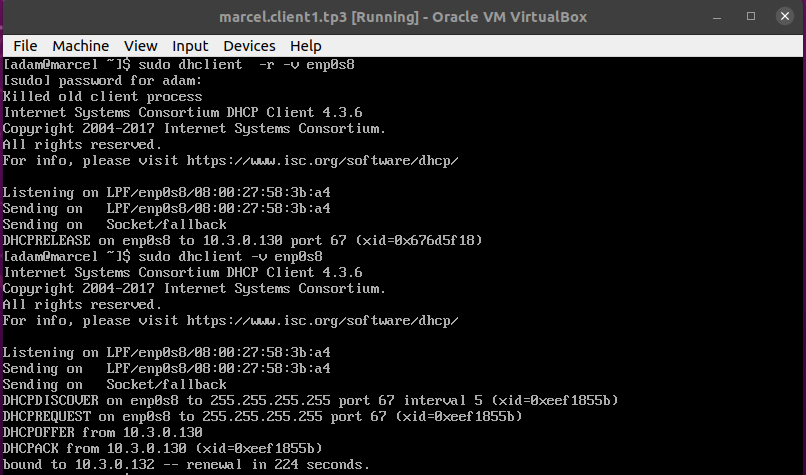

# TP3 : Progressons vers le réseau d'infrastructure
# 0. Prérequis
# I. (mini)Architecture réseau

**Vous me rendrez un 🗃️ tableau des réseaux 🗃️ qui rend compte des adresses choisies, sous la forme** :

| Nom du réseau | Adresse du réseau | Masque            | Nombre de clients possibles | Adresse passerelle | [Adresse broadcast|
|---------------|-------------------|-------------------|-----------------------------|--------------------|-------------------|
| `server1`     | `10.3.0.0/25`     | `255.255.255.128` | `128 - 3 = 125`             | `10.3.0.126`       | `10.3.0.127`      |
| `client1`     | `10.3.0.128/26`   | `255.255.255.192` | `64 - 3 = 61`               | `10.3.0.190`       | `10.3.0.191`      |
| `server2`     | `10.3.0.192/26`   | `255.255.255.192` | `64 - 3 = 61`               | `10.3.0.254`       | `10.3.3.255`      |

**Vous pouvez d'ores-et-déjà créer le routeur. Pour celui-ci, vous me prouverez que :**

- il a bien une IP dans les 3 réseaux, l'IP que vous avez choisie comme IP de passerelle
```
[adam@router ~]$ ip a
[...]
3: enp0s8: <BROADCAST,MULTICAST,UP,LOWER_UP> mtu 1500 qdisc fq_codel state UP group default qlen 1000
    link/ether 08:00:27:b8:38:b3 brd ff:ff:ff:ff:ff:ff
    inet 10.3.0.126/25 brd 10.3.0.127 scope global noprefixroute enp0s8
       valid_lft forever preferred_lft forever
    inet6 fe80::a00:27ff:feb8:38b3/64 scope link 
       valid_lft forever preferred_lft forever
4: enp0s9: <BROADCAST,MULTICAST,UP,LOWER_UP> mtu 1500 qdisc fq_codel state UP group default qlen 1000
    link/ether 08:00:27:8f:11:f7 brd ff:ff:ff:ff:ff:ff
    inet 10.3.0.190/26 brd 10.3.0.191 scope global noprefixroute enp0s9
       valid_lft forever preferred_lft forever
    inet6 fe80::a00:27ff:fe8f:11f7/64 scope link 
       valid_lft forever preferred_lft forever
5: enp0s10: <BROADCAST,MULTICAST,UP,LOWER_UP> mtu 1500 qdisc fq_codel state UP group default qlen 1000
    link/ether 08:00:27:5e:13:2b brd ff:ff:ff:ff:ff:ff
    inet 10.3.0.254/26 brd 10.3.0.255 scope global noprefixroute enp0s10
       valid_lft forever preferred_lft forever
    inet6 fe80::a00:27ff:fe5e:132b/64 scope link 
       valid_lft forever preferred_lft forever
```
- il a un accès internet
```
[adam@router ~]$ ping ynov.com
PING ynov.com (92.243.16.143) 56(84) bytes of data.
64 bytes from xvm-16-143.dc0.ghst.net (92.243.16.143): icmp_seq=1 ttl=63 time=19.6 ms
64 bytes from xvm-16-143.dc0.ghst.net (92.243.16.143): icmp_seq=2 ttl=63 time=20.9 ms
^C
--- ynov.com ping statistics ---
2 packets transmitted, 2 received, 0% packet loss, time 1002ms
rtt min/avg/max/mdev = 19.559/20.204/20.850/0.660 ms
```
- il a de la résolution de noms
```
[adam@router ~]$ dig ynov.com

; <<>> DiG 9.11.26-RedHat-9.11.26-4.el8_4 <<>> ynov.com
;; global options: +cmd
;; Got answer:
;; ->>HEADER<<- opcode: QUERY, status: NOERROR, id: 46964
;; flags: qr rd ra; QUERY: 1, ANSWER: 1, AUTHORITY: 0, ADDITIONAL: 1

;; OPT PSEUDOSECTION:
; EDNS: version: 0, flags:; udp: 65494
;; QUESTION SECTION:
;ynov.com.			IN	A

;; ANSWER SECTION:
ynov.com.		7172	IN	A	92.243.16.143

;; Query time: 0 msec
;; SERVER: 10.0.2.3#53(10.0.2.3)
;; WHEN: Thu Sep 30 16:21:52 CEST 2021
;; MSG SIZE  rcvd: 53
```
- il porte le nom `router.tp3`*
```
[adam@router ~]$ sudo cat /etc/hostname
[sudo] password for adam: 
router.tp3
```
- n'oubliez pas [d'activer le routage sur la machine](../../cours/memo/rocky_network.md#activation-du-routage)
```
[adam@router ~]$ sudo firewall-cmd --list-all
public (active)
  target: default
  icmp-block-inversion: no
  interfaces: enp0s10 enp0s3 enp0s8 enp0s9
  sources: 
  services: cockpit dhcpv6-client ssh
  ports: 
  protocols: 
  masquerade: yes
  forward-ports: 
  source-ports: 
  icmp-blocks: 
  rich rules: 
```

# II. Services d'infra
## 1. Serveur DHCP

**VM `dhcp.client1.tp3`**

**Mettre en place une machine qui fera office de serveur DHCP** dans le réseau `client1`. Elle devra :

- porter le nom `dhcp.client1.tp3`
```
[adam@dhcp ~]$ sudo cat /etc/hostname
dhcp.client1.tp3
```
- [📝**checklist**📝](#checklist)
- donner une IP aux machines clients qui le demande
```
# specify the range of lease IP address
  range dynamic-bootp 10.3.0.131 10.3.0.189;
``` 
- leur donner l'adresse de leur passerelle
```
 # specify gateway
 option routers 10.3.0.190;
```
- leur donner l'adresse d'un DNS utilisable
```
# specify DNS server's hostname or IP address
option domain-name-servers     1.1.1.1; 
```

📁 **Fichier `dhcpd.conf`**

**VM marcel.client1.tp3**

**Mettre en place un client dans le réseau `client1`**

- de son p'tit nom `marcel.client1.tp3`
```
[adam@node2 ~]$ sudo cat /etc/hostname
marcel.client1.tp3
[adam@node2 ~]$ sudo cat /etc/hosts
127.0.0.1   localhost localhost.localdomain localhost4 localhost4.localdomain4
::1         localhost localhost.localdomain localhost6 localhost6.localdomain6
10.3.0.190  router.tp3
10.3.0.130  dhcp.client1.tp3
```
- [📝**checklist**📝](#checklist)
- la machine récupérera une IP dynamiquement grâce au serveur DHCP
en premier temps je mes ma carte réseau en dynamique
```
[adam@marcel ~]$ sudo cat /etc/sysconfig/network-scripts/ifcfg-enp0s8

NAME=enp0s8
DEVICE=enp0s8
ONBOOT=yes
BOOTPROTO=dhcp
```
Après avoir reload et up la carte résau nous allons demander un nouvelle ip avec la commende dhclient



```
[adam@marcel ~]$ ip a
1: lo: <LOOPBACK,UP,LOWER_UP> mtu 65536 qdisc noqueue state UNKNOWN group default qlen 1000
    link/loopback 00:00:00:00:00:00 brd 00:00:00:00:00:00
    inet 127.0.0.1/8 scope host lo
       valid_lft forever preferred_lft forever
    inet6 ::1/128 scope host 
       valid_lft forever preferred_lft forever
2: enp0s8: <BROADCAST,MULTICAST,UP,LOWER_UP> mtu 1500 qdisc fq_codel state UP group default qlen 1000
    link/ether 08:00:27:58:3b:a4 brd ff:ff:ff:ff:ff:ff
    inet 10.3.0.132/26 brd 10.3.0.191 scope global dynamic noprefixroute enp0s8
       valid_lft 571sec preferred_lft 571sec
    inet6 fe80::a00:27ff:fe58:3ba4/64 scope link 
       valid_lft forever preferred_lft forever
[adam@marcel ~]$ 
```
- ainsi que sa passerelle et une adresse d'un DNS utilisable
```
[adam@marcel ~]$ ip r s
default via 10.3.0.190 dev enp0s8 proto dhcp metric 100 
10.3.0.128/26 dev enp0s8 proto kernel scope link src 10.3.0.132 metric 100 
```
```
[adam@marcel ~]$ dig ynov.com

; <<>> DiG 9.11.26-RedHat-9.11.26-4.el8_4 <<>> ynov.com
[...]
;; SERVER: 1.1.1.1#53(1.1.1.1)
;; WHEN: Sun Oct 17 16:37:56 CEST 2021
;; MSG SIZE  rcvd: 53

[adam@marcel ~]$ 
```
**Depuis `marcel.client1.tp3`**

- prouver qu'il a un accès internet + résolution de noms, avec des infos récupérées par votre DHCP
```
[adam@marcel ~]$ ping google.com
PING google.com (216.58.215.46) 56(84) bytes of data.
64 bytes from par21s17-in-f14.1e100.net (216.58.215.46): icmp_seq=1 ttl=61 time=15.2 ms
64 bytes from par21s17-in-f14.1e100.net (216.58.215.46): icmp_seq=2 ttl=61 time=17.6 ms
^C
--- google.com ping statistics ---
2 packets transmitted, 2 received, 0% packet loss, time 1002ms
rtt min/avg/max/mdev = 15.227/16.430/17.634/1.210 ms
[adam@marcel ~]$ 
```
- à l'aide de la commande `traceroute`, prouver que `marcel.client1.tp3` passe par `router.tp3` pour sortir de son réseau
```
[adam@marcel ~]$ traceroute ynov.com
traceroute to ynov.com (92.243.16.143), 30 hops max, 60 byte packets
 1  router.tp3 (10.3.0.190)  4.061 ms  4.146 ms  3.977 ms
 2  10.0.2.2 (10.0.2.2)  3.901 ms  3.474 ms  3.371 ms
 3  * * *
 4  33bdx1-nro-2.nro.gaoland.net (109.24.76.79)  6.391 ms  6.236 ms  6.130 ms
 5  205.142.24.109.rev.sfr.net (109.24.142.205)  7.338 ms  10.923 ms  10.740 ms
 6  40.147.6.194.rev.sfr.net (194.6.147.40)  16.401 ms  12.074 ms  12.032 ms
 7  40.147.6.194.rev.sfr.net (194.6.147.40)  11.257 ms  16.041 ms  15.922 ms
 8  gandi.par.franceix.net (37.49.236.154)  15.769 ms  15.358 ms  15.435 ms
 9  port-channel10.edge-1.sd4.paris.ip4.as29169.net (155.133.187.25)  14.479 ms  14.635 ms  14.495 ms
10  ethernet20-1.core-2.csd5.paris.ip4.as29169.net (173.246.102.25)  14.093 ms ethernet18-1.core-2.csd4.paris.ip4.as29169.net (173.246.102.3)  13.700 ms  13.085 ms
11  Ethernet31-1.dcgw-1b.sd6.paris.ip4.as29169.net (217.70.176.21)  12.900 ms  12.611 ms Ethernet31-1.dcgw-1r.sd6.ip4.gandi.net (217.70.176.23)  13.078 ms
12  team505.igw-1-r.sd6.paris.ip4.as203476.net (155.133.140.3)  12.342 ms  12.082 ms  11.615 ms^C
[adam@marcel ~]$ 
```

## 2. Serveur DNS
### A. Our own DNS server
### B. SETUP copain

**Mettre en place une machine qui fera office de serveur DNS**

- dans le réseau `server1`
```
[adam@dns1 ~]$ ip a
[...]
2: enp0s8: <BROADCAST,MULTICAST,UP,LOWER_UP> mtu 1500 qdisc fq_codel state UP group default qlen 1000
    link/ether 08:00:27:15:f1:20 brd ff:ff:ff:ff:ff:ff
    inet 10.3.0.2/25 brd 10.3.0.127 scope global noprefixroute enp0s8
       valid_lft forever preferred_lft forever
    inet6 fe80::a00:27ff:fe15:f120/64 scope link 
       valid_lft forever preferred_lft forever
[adam@dns1 ~]$ 
```
- de son p'tit nom `dns1.server1.tp3`
```
[adam@dns1 ~]$ hostname
dns1.server1.tp3
[adam@dns1 ~]$ 
```
- [📝**checklist**📝](#checklist)
- il faudra lui ajouter un serveur DNS public connu, afin qu'il soit capable de résoudre des noms publics comme `google.com`
  - conf classique avec le fichier `/etc/resolv.conf` ou les fichiers de conf d'interface
- comme pour le DHCP, on part sur "rocky linux dns server" on Google pour les détails de l'install du serveur DNS
```
[adam@dns1 ~]$ cat /etc/resolv.conf
# Generated by NetworkManager
search server1.tp3
nameserver 1.1.1.1
[adam@dns1 ~]$ 
```
  - le paquet que vous allez installer devrait s'appeler **`bind` : c'est le nom du serveur DNS le plus utilisé au monde**
```
[adam@dns1 ~]$ sudo dnf -y install bind
Installed:
  bind-32:9.11.26-4.el8_4.x86_64                                                                                                                                                
Complete!
[adam@dns1 ~]$ 
```
- il y aura plusieurs fichiers de conf :
  - un fichier de conf principal `named.conf`
```
[adam@dns1 ~]$ sudo cat /etc/named.conf 
//
// named.conf
//
// Provided by Red Hat bind package to configure the ISC BIND named(8) DNS
// server as a caching only nameserver (as a localhost DNS resolver only).
//
// See /usr/share/doc/bind*/sample/ for example named configuration files.
//

options {
	listen-on port 53 { localhost;10.3.0.2; };
	listen-on-v6 port 53 { ::1; };
	directory 	"/var/named";
	dump-file 	"/var/named/data/cache_dump.db";
	statistics-file "/var/named/data/named_stats.txt";
	memstatistics-file "/var/named/data/named_mem_stats.txt";
	secroots-file	"/var/named/data/named.secroots";
	recursing-file	"/var/named/data/named.recursing";
	allow-query     { localhost; };

	/* 
	 - If you are building an AUTHORITATIVE DNS server, do NOT enable recursion.
	 - If you are building a RECURSIVE (caching) DNS server, you need to enable 
	   recursion. 
	 - If your recursive DNS server has a public IP address, you MUST enable access 
	   control to limit queries to your legitimate users. Failing to do so will
	   cause your server to become part of large scale DNS amplification 
	   attacks. Implementing BCP38 within your network would greatly
	   reduce such attack surface 
	*/
	recursion no;

	dnssec-enable yes;
	dnssec-validation yes;

	managed-keys-directory "/var/named/dynamic";

	pid-file "/run/named/named.pid";
	session-keyfile "/run/named/session.key";

	/* https://fedoraproject.org/wiki/Changes/CryptoPolicy */
	include "/etc/crypto-policies/back-ends/bind.config";
};

logging {
        channel default_debug {
                file "data/named.run";
                severity dynamic;
        };
};

zone "." IN {
	type hint;
	file "named.ca";
};

zone "server1.tp3" IN {
	type master;
	file "/var/named/server1.tp3.forward";
	allow-update { none; };
};

zone "server2.tp3" IN {
        type master;
        file "/var/named/server2.tp3.forward";
        allow-update { none; };
};
include "/etc/named.rfc1912.zones";
include "/etc/named.root.key";
[adam@dns1 ~]$ 
```
  - des fichiers de zone "forward"
    - permet d'indiquer une correspondance nom -> IP
    - un fichier par zone forward
  - **vous ne mettrez pas en place de zones reverse, uniquement les forward**
  - on ne met **PAS** les clients dans les fichiers de zone car leurs adresses IP peuvent changer (ils les récupèrent à l'aide du DHCP)
    - donc votre DNS gérera deux zones : `server1.tp3` et `server2.tp3`
    - les réseaux où les IPs sont définies de façon statique !
```
[adam@dns1 ~]$ sudo cat /var/named/server1.tp3.forward
$TTL 86400
@   IN  SOA     dns1.server1.tp3. admin.server1.tp3. (
         2021062301  ; Serial
         3600        ; Refresh
         1800        ; Retry
         604800      ; Expire
         86400       ; Minimum TTL
)
        IN  NS   dns1.server1.tp3.
        IN  A    10.3.0.2

dns1   IN    A   10.3.0.2
router IN    A   10.3.0.126
dhcp   IN    A   10.3.0.130

[adam@dns1 ~]$ sudo cat /var/named/server2.tp3.forward
$TTL 86400
@   IN  SOA     dns1.server2.tp3. admin.server2.tp3. (
         2021062301  ; Serial
         3600        ; Refresh
         1800        ; Retry
         604800      ; Expire
         86400       ; Minimum TTL
) 	
        IN  NS   dns1.server2.tp3.
        IN   A    10.3.0.2
```
**Tester le DNS depuis `marcel.client1.tp3`**
- définissez **manuellement** l'utilisation de votre serveur DNS
```
[adam@marcel ~]$ cat /etc/resolv.conf 
; generated by /usr/sbin/dhclient-script
search client1.tp3
nameserver 10.3.0.2
```
- essayez une résolution de nom avec `dig`
  - une résolution de nom classique
    - `dig <NOM>` pour obtenir l'IP associée à un nom
```
[adam@marcel ~]$ dig dns1.server1.tp3

; <<>> DiG 9.11.26-RedHat-9.11.26-4.el8_4 <<>> dns1.server1.tp3
;; global options: +cmd
;; Got answer:
;; ->>HEADER<<- opcode: QUERY, status: REFUSED, id: 20763
;; flags: qr rd; QUERY: 1, ANSWER: 0, AUTHORITY: 0, ADDITIONAL: 1
;; WARNING: recursion requested but not available

;; OPT PSEUDOSECTION:
; EDNS: version: 0, flags:; udp: 1232
; COOKIE: 7b827f9b679beb7786c7c6f4616c8e2a5f0754e8cc35622d (good)
;; QUESTION SECTION:
;dns1.server1.tp3.		IN	A

;; Query time: 2 msec
;; SERVER: 10.3.0.2#53(10.3.0.2)
;; WHEN: Sun Oct 17 22:57:22 CEST 2021
;; MSG SIZE  rcvd: 73

[adam@marcel ~]$ 
```
    - on teste la zone forward
```
[adam@marcel ~]$ ping dns1.server1.tp3
ping: dns1.server1.tp3: Name or service not known
```
- prouvez que c'est bien votre serveur DNS qui répond pour chaque `dig`
```
[adam@marcel ~]$ dig dns1.server1.tp3
[...]
;; SERVER: 10.3.0.2#53(10.3.0.2)
[...]
```

Configurez l'utilisation du serveur DNS sur TOUS vos noeuds

- les serveurs, on le fait à la main
```
[adam@dns1 ~]$ sudo cat /var/named/server1.tp3.forward
$TTL 86400
@   IN  SOA     dns1.server1.tp3. admin.server1.tp3. (
         2021062301  ; Serial
         3600        ; Refresh
         1800        ; Retry
         604800      ; Expire
         86400       ; Minimum TTL
)
        IN  NS   dns1.server1.tp3.
        IN  A    10.3.0.2

dns1   IN    A   10.3.0.2
router IN    A   10.3.0.126
dhcp   IN    A   10.3.0.130
```
- les clients, c'est fait *via* DHCP
```
[adam@dhcp ~]$ sudo cat /etc/dhcp/dhcpd.conf
[sudo] password for adam: 
#
# default lease time
default-lease-time 600;

# max lease time
max-lease-time 7200;

# this DHCP server to be declared valid
authoritative;

# specify DNS server's hostname or IP address
option domain-name-servers     10.3.0.2; 

# specify network address and subnetmask
subnet 10.3.0.128 netmask 255.255.255.192 {
    # specify the range of lease IP address
    range dynamic-bootp 10.3.0.131 10.3.0.189;
    # specify broadcast address
    option broadcast-address 10.3.0.191;
    # specify gateway
    option routers 10.3.0.190;
}
```
## 3. Get deeper
### A. DNS forwarder

**Affiner la configuration du DNS**

- faites en sorte que votre DNS soit désormais aussi un forwarder DNS
- c'est à dire que s'il ne connaît pas un nom, il ira poser la question à quelqu'un d'autre
```
[adam@dns1 ~]$ sudo cat /etc/named.conf 
[...]
	recursion yes;

[...]
```

Test !

- vérifier depuis `marcel.client1.tp3` que vous pouvez résoudre des noms publics comme `google.com` en utilisant votre propre serveur DNS (commande `dig`)
- pour que ça fonctionne, il faut que `dns1.server1.tp3` soit lui-même capable de résoudre des noms, avec `1.1.1.1` par exemple
```
[adam@dns1 ~]$ dig google.com

; <<>> DiG 9.11.26-RedHat-9.11.26-4.el8_4 <<>> google.com
;; global options: +cmd
;; Got answer:
;; ->>HEADER<<- opcode: QUERY, status: NOERROR, id: 17684
;; flags: qr rd ra; QUERY: 1, ANSWER: 1, AUTHORITY: 0, ADDITIONAL: 1

;; OPT PSEUDOSECTION:
; EDNS: version: 0, flags:; udp: 1232
;; QUESTION SECTION:
;google.com.			IN	A

;; ANSWER SECTION:
google.com.		284	IN	A	216.58.201.238

;; Query time: 18 msec
;; SERVER: 1.1.1.1#53(1.1.1.1)
;; WHEN: Sun Oct 17 23:06:30 CEST 2021
;; MSG SIZE  rcvd: 55

[adam@marcel ~]$ dig google.com

; <<>> DiG 9.11.26-RedHat-9.11.26-4.el8_4 <<>> google.com
;; global options: +cmd
;; Got answer:
;; ->>HEADER<<- opcode: QUERY, status: REFUSED, id: 21842
;; flags: qr rd; QUERY: 1, ANSWER: 0, AUTHORITY: 0, ADDITIONAL: 1
;; WARNING: recursion requested but not available

;; OPT PSEUDOSECTION:
; EDNS: version: 0, flags:; udp: 1232
; COOKIE: b18f715a0c7da6e69e2bb9d5616c906804a43a022886b915 (good)
;; QUESTION SECTION:
;google.com.			IN	A

;; Query time: 1 msec
;; SERVER: 10.3.0.2#53(10.3.0.2)
;; WHEN: Sun Oct 17 23:06:55 CEST 2021
;; MSG SIZE  rcvd: 67
```

### B. On revient sur la conf du DHCP
**Affiner la configuration du DHCP**

- faites en sorte que votre DHCP donne désormais l'adresse de votre serveur DNS aux clients
- créer un nouveau client `johnny.client1.tp3` qui récupère son IP, et toutes les nouvelles infos, en DHCP

# Entracte

**YO !**

**On se pose deux minutes pour apprécier le travail réalisé.**

A ce stade vous avez :

- un routeur qui permet aux machines d'acheminer leur trafic entre les réseaux
  - entre les LANs
  - vers internet
- un DHCP qui filent des infos à vos clients
  - une IP, une route par défaut, l'adresse d'un DNS
- un DNS
  - qui résout tous les noms localement

Vous le sentez là que ça commence à prendre forme oupa ? Tous les réseaux du monde sont fichus comme ça c:


